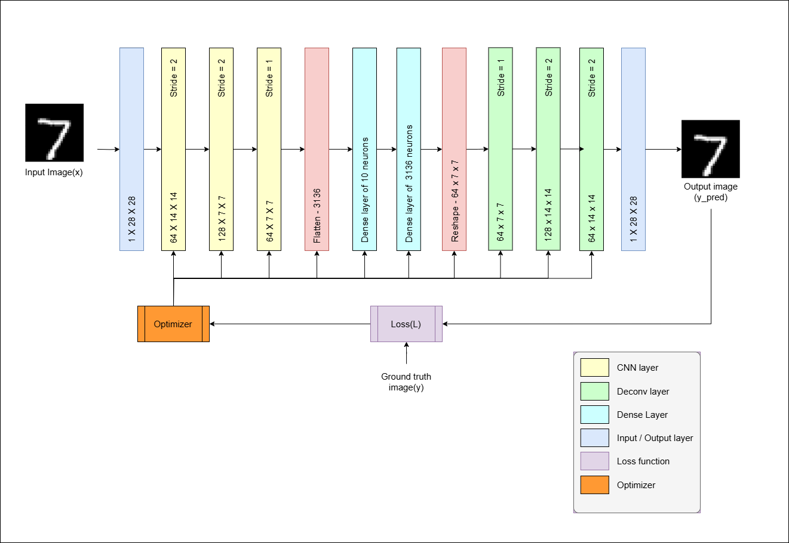
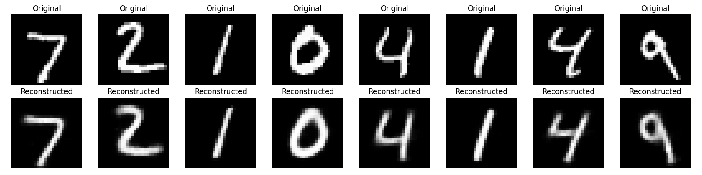

# 🧠 MNIST Autoencoder in PyTorch

This project implements a **autoencoder** using **PyTorch** to reconstruct handwritten digit images from the **MNIST** dataset. It includes training, evaluation, model checkpointing, and visualization of reconstructed digits.

---

## 🖼️ Architecture

The autoencoder architecture is composed of:

- **Encoder**: 3 convolutional layers
- **Dense Bottleneck**: Linear → 10 neurons → Linear → reshape
- **Decoder**: 3 transposed convolutional layers

 

---

## 🛠️ Features

- End-to-end training pipeline with `tqdm` progress
- Save best model based on validation loss
- Evaluation with MSE reconstruction loss
- Visual comparison between original and reconstructed digits
- Easily extendable to other image datasets

---
## 📤 Outputs
- `trained_models/model2` was trained for `240` epochs and attained a final loss of `0.0160`.
- The model attained a evaluation loss of `0.018172`.
- The visualization of some evaluation is stored under `results` directory.


## 🚀 Getting Started

### 1. Clone the Repo
```bash
git clone https://github.com/yourusername/mnist-autoencoder-pytorch.git
cd mnist-autoencoder-pytorch
